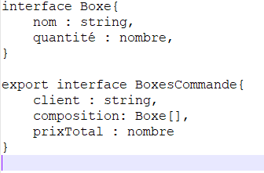

# SushiFast
## Information
Nom/Prénom: SOW Awa

Date projet: 15/12/2021

Technologie: NodeJS, MongoDB, Angular

lien github: https://github.com/awa-dev/SushiFast

## Le but du Projet
Ce projet à pour but de développer une appliaction pour une prise de commande au niveau d'un point de vente. Il aura pour résultat essentiel le calcul d'une commande de plateaux de Sushi.
La commande peut être prise via téléphone ou sur place.

## Objectifs
J'utiliserai une application Back-end dans le cadre d'une API qui présentera les produits de la vente


# Première partie:

Tout d’abord j’ai créé mon application que j'ai nommé "ShushiFast".
Puis j’ai installé le framwork bulma et dans angular.json j'ai mis le style.
```php
 "styles": [


              "node_modules/bulma/css/bulma.min.css",
              "src/styles.css"
            ],
```

Dans mon application (SushiFast est une application  FrondEnd) j’ai inséré un back-end (sushiApi) JSon Server qui me servira comme une source de donné pour mon application afin d’interrogé le server, j'ai utiliser cette commande pour le faire: npm install –g json-server.
Voici le script qui permet de connecté à l'api (boxes.service.ts)

```php
import { Injectable } from '@angular/core';
import { catchError } from 'rxjs/operators';
import { HttpClient, HttpHeaders, HttpErrorResponse } from '@angular/common/http';
import { Observable, throwError } from 'rxjs';

export interface Boxes {
  id: number;
  name: string;
  piece: number;
  prix: number;
  saveur: string;
  }
  
const urlrest = 'http://localhost:3000';

@Injectable({
  providedIn: 'root'
})

export class BoxesService {
  
  private boxe: Boxes[];

  constructor(private http: HttpClient) { 
    this.boxe = [];
  }
  httpHeader = {
    headers: new HttpHeaders({
    'Content-Type': 'application/json'
    })
  }
  // interrogation de l'API (BackEnd) pour afficher les plateaux
  getBoxes(): Observable<any> {
    return this.http.get<any>(urlrest + '/boxes').pipe(
    catchError(this.handleError)
    );
  }
```

# Diagrammes:
Ensuite j'ai fait une analyse du projet en faisant un diagrammes des cas d'utilisation et les requêtes illustrées sur l’API concernant l’ensemble des plateaux.

## Diagramme des cas d'utilisation
Ce diagramme me permet de savoir les rêquetes que l'opérateur fait. 
L’opérateur a la possibilité de consulter les plateaux et en même temps de voir la composition d'un plateaux, il a aussi la possibilité de créer un panier et il peut modifier, visualiser un panier et aussi voir les commandes enregistré dans le LocalStorage.


## Les requêtes illustrées sur l’API (client/serveur)
Ce diagramme permet à l'opératuer d'émettre un requête vers le serveur, et dès que le serveur reçoit la demande il le repond et l'envoi en retour une réponse


# RGPD
Puis dans le footer, j'ai définit un lien hypertexte pour le RGPD afin d'identifier le responsable du site et l'endroit ou mon site est hébergé. Dès qu'on clique sur "mention légale" vous serer redirigé sur une page dans laquelle il y a la mention légale.
```php
 <footer>
    <div class="content has-text-centered" >
      <a [routerLink]="['/rgpd']" > 
        Mention Légal 
      </a> 
    </div>
  </footer>
```


# Format de structure JSON des commandes enregistées dans le localStorage

A la fermeture du navigateur les plateaux mis dans le panier les données seront perdu car il n'est pas sauvegarder car tout se trouve dans le DOM. Pour tous enregistré je vais utilisé la technique du LocalStorage.
Dans "boxes.service.ts" j'ai mis une méthode qui va permettre de reception des données à partir du LocalStorage.

```php
getAllBoxes() {
    this.boxe = JSON.parse(localStorage.getItem('Boxes') || '[]');
    return this.boxe;
    
  }
```
Ensuite j'ai mis une méthode qui prend en compte du stockage au niveau de la méthode pour l'ajout des plateaux. (L'envoi des données dans le LocalStorage).

```php
  addBoxe(boxe: Boxes) {
    this.boxe.push(boxe);

    let tabItems = JSON.stringify(this.boxe);
    localStorage.setItem('Boxes', tabItems);
  }
```
### Structure JSon
Elle prend le nom du client, elle contient un tableau Boxe et le prix total de la commande.



# Deuxième partie:

## Affichage des plateaux
La fonction fetchBoxes me permet de récupérer le service (boxesService) afin de récupérer l'ensemble des plateaux je l'ai mis dans home.components.ts. 

```php
 fetchBoxes() {
       return this.boxesService.getBoxes().subscribe((data: {}) => {
    this.Boxes = data;
    }) 
    }
```
Après avoir fait la fonction fetchBoxes, dans le home.components.html, j'ai fais un boucle (ngFor) qui va permettre d'afficher tous les plateaux  et les boutons + , détail et - qui permettent d'ajouter une commande de supprimer ou voir le détail de chaque plateaux
```php
   <!--  affichage des plateaux -->
        <div class="Box">
            <div class="p-5 " *ngFor="let boxe of Boxes ; let index = index"  >
                <div class="p-3" class="bg-light border border-primary">
                    <a ></a>
                </div>
                <div class="p-3" > 
                    <span class=Itemitle> {{boxe.nom}}</span>
                </div>
                <div class="p-3" > 
                    <span class=Itemitle> {{boxe.prix}}€ | {{boxe.pieces}}Pièces</span>
                </div>
                <div class="has-text-centered">
                    <button class="button is-link" (click)="plus(index)">+</button>
                    <button class="button is-link" (click)="affModal(index)" >Détail</button>
                    <button class="button is-link" (click)="moins(index)">-</button>
                </div>
        </div>
```
En lançant le server ng serve le programme se lance et affiche la liste des plateaux.


## Affichage des détails de chaque plateaux, ajout d'une commande (+), calcul de la commande
 En cliquant sur le bouton détail, le modal sera activé et j'ai accés au détail du plateaux auquel j'ai cliqué

 ```php
   // functionpour afficher les détails de chaque plateau
  affModal(i: number) {
    if (this.showModal) {
      this.showModal = false;
    } else {
      console.log("Modal indice :" + i);    
      console.log("Modal nom plateau :" + this.Boxes[i].nom);
      this.boxe = this.Boxes[i];
      this.showModal = true;
    }
  }
 ```
 ```php
  <!-- détail de chaque plateau sa déclanche le modal -->
  <div class="modal is-active" *ngIf="showModal">
        <div class="modal-background"></div>
            <div class="modal-content">
                <h1 class="title is-3" style="color:azure;">{{boxe.nom}}</h1>
                <br />
                <h3 style="color:yellow;">Nombre de pièces :</h3> <p style="color: white ;">{{boxe.pieces}}</p>
                <h3 style="color:yellow;">Saveurs: </h3> <p style="color: white ;">{{boxe.saveurs}}</p>
                <h3 style="color:yellow;">Compositions:</h3> 
                <!-- la composition c'est un tableau d'object  -->
                <p style="color: white ;" *ngFor="let boxe of boxe.composition " >{{boxe.nom}} ,{{boxe.quantite}}  </p>
                
                <br />
                <button class="button is-primary" (click)="affModal(0)">Fermer</button>
            </div>
    
        </div>
   </div> 
 ```
Voilà ce que sa donne dans le programme


 ## Ajout d'une commande (+), calcul de la commande

Dans commande (panier), affiche les plateaux et l'enregistre dans le localStorage. le panier contient les éléments enregistré dans le localStorage. Il affiche aussi le total des commandes


Puis, dès que je clique sur (+), cela me permet d'ajouter le plateau auquel j'ai cliqué dans commande(panier)


```php
plus(index: number) {
    //je récupere ce qui est dans le local recupere du json et le parse le transfome en ts 
    this.commande = JSON.parse(localStorage.getItem('SushiCommande') || '[]');
    let ajout = false;
    this.commande.forEach(elem=> {
      if (elem.id ==  this.Boxes[index].id) {
        elem.quantite++;
        ajout = true;
      }
    });

    if (!ajout) {
      let uneLigne = new LigneCommande(this.Boxes[index].id, this.Boxes[index].nom,1, this.Boxes[index].prix);
      this.commande.push(uneLigne);
      console.log("Plus :" + index + this.Boxes[index].nom);
    }
  // enregistre dans le localStorage
    let tabItems = JSON.stringify(this.commande);
    localStorage.setItem('SushiCommande', tabItems);
    
  }
```
```php
   // function pour calculer la total des commandes
  totalCommande(){
    let total=0.0;
    this.commande.forEach(elem => {
     total=total+(elem.prix*elem.quantite); 
    });
    return total
  }
 
```
# Evil Story
1) En tant que malveillant, j'aimerai commandé plusieurs commandes afin de faire bugger le système.

    En tant que développeur, je dois me charger de faire en sorte que personne ne pourrait faire plus de 5 ou 10 commandes en un certain durée. c'est à dire je dois limité l'ajout d'un plateau dans le panier en ajoutant un compteur

2)  En tant que malveillant, je veux poster un
commentaire afin de donner un avis négative sur la qualité de commande.

      En tant que développeur, je dois m'assurer de faire en sorte de filtré des commentaires négative et de ne pas les afficher. Les commentaire négative peut entrainer à la perte de clientèle


